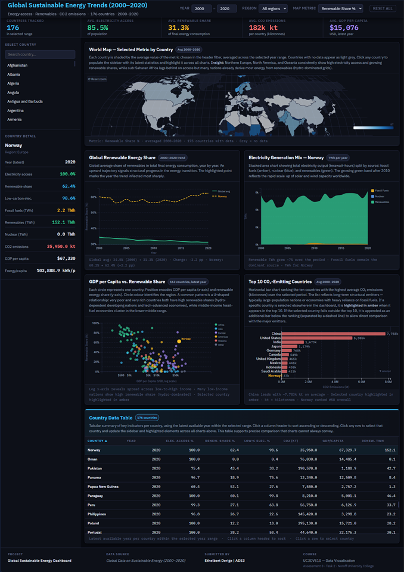

# GlobalDataVisualization

Interactive D3.js dashboard exploring global sustainable energy trends from 2000–2020 across 176 countries.

<p align="center">
  
</p>

The dashboard provides insights into:

- Electricity access
- Renewable energy adoption
- Low-carbon electricity generation
- CO₂ emissions
- GDP per capita
- Regional energy comparisons
- Country-level energy profiles

---

## Project Structure

```text
project-folder/
│
├── index.html
├── style.css
├── script.js
│
├── data/
│   └── global-data-on-sustainable-energy.csv
│
├── libs/
│   └── topojson-client.min.js
│
├── preprocessing/
│   └── data_exploration.ipynb
│   └── image_task2.png
│   └── requirements.txt
│
├── README.md
└── LICENSE
```

---

## Requirements

Before running the project, ensure the following software is installed:

- Python 3.10 or newer
- Git (optional, for cloning the repository)

Verify Python installation:

```bash
python --version
```

or

```bash
python3 --version
```

---

## Clone the Repository

```bash
git clone https://github.com/ethder00895/GlobalDataVisualization.git
cd YOUR_REPOSITORY
```

Or download the repository as a ZIP file and extract it locally.

---

## Create a Virtual Environment (Recommended)

### Windows

```bash
python -m venv venv
venv\Scripts\activate
```

### Linux / macOS

```bash
python3 -m venv venv
source venv/bin/activate
```

---

## Install Dependencies

All required Python packages are listed in the included `requirements.txt` file.

Install them using:

```bash
pip install -r requirements.txt
```

---

## Running the Dashboard

The dashboard loads CSV files through JavaScript and must be served through a local web server.

Navigate to the project root folder:

```bash
cd PROJECT_ROOT_FOLDER
```

Start a local Python web server:

```bash
python -m http.server 8000
```

or

```bash
python3 -m http.server 8000
```

Open your browser and navigate to:

```text
http://localhost:8000
```

The dashboard should now load successfully.

---

## Dashboard Features

### Interactive World Map

- Choropleth world map
- Zoom and pan support
- Country selection
- Dynamic metric switching

### KPI Summary Cards

- Countries tracked
- Average electricity access
- Average renewable share
- Average CO₂ emissions
- Average GDP per capita

### Renewable Energy Trends

- Global renewable energy share over time
- Historical trend analysis

### Electricity Generation Mix

- Fossil fuels
- Nuclear energy
- Renewable energy

### Regional Comparisons

- Multi-region comparisons
- Interactive visual analytics

### Country Drill-Down

Select a country to view:

- Electricity access
- Renewable energy share
- Low-carbon electricity
- Electricity generation mix
- CO₂ emissions
- GDP per capita
- Energy consumption metrics

---

## Data Source

Dataset:

**Global Data on Sustainable Energy (2000–2020)**

Contains information on:

- 176 countries
- Energy access indicators
- Renewable energy metrics
- Electricity generation statistics
- GDP indicators
- CO₂ emissions
- Energy consumption data

---

## Troubleshooting

### CSV File Not Loading

Verify the dataset exists in:

```text
data/global-data-on-sustainable-energy.csv
```

and ensure the project is running through a local web server.

Do **not** open `index.html` directly from your file explorer.

---

### Port Already in Use

Use another port:

```bash
python -m http.server 8080
```

Then open:

```text
http://localhost:8080
```

---

## Technologies Used

- HTML5
- CSS3
- JavaScript (ES6)
- D3.js v7
- TopoJSON
- Python
- JupyterLab

---

## Live Demo

The dashboard is publicly available through GitHub Pages.

Open the project directly in your browser:

```text
https://ethder00895.github.io/GlobalDataVisualization/
```

## License

This project is distributed under the terms described in the LICENSE file.
